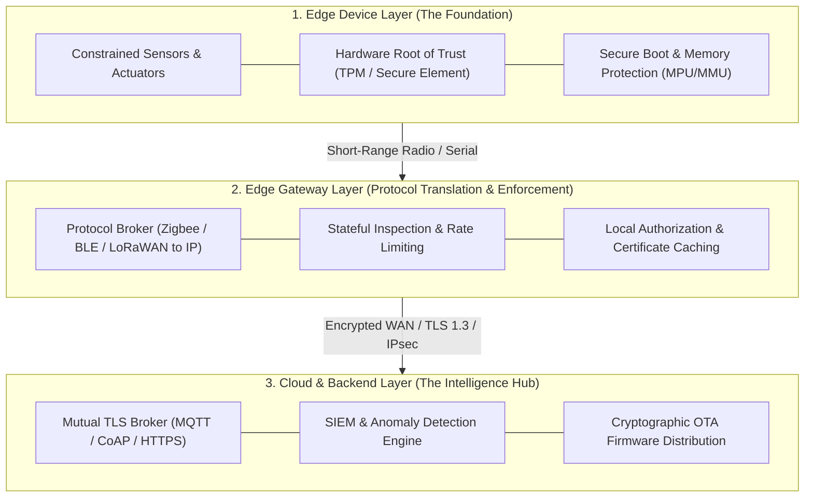

# Defense-in-Depth Security Architecture for IoT Networks

A comprehensive cybersecurity framework and engineering blueprint delivering a **Defense-in-Depth** architecture for Internet of Things (IoT) networks. The research covers end-to-end security implementations spanning **constrained edge devices**, **edge gateways**, and **cloud intelligence hubs**, detailing mutual authentication, cryptographic protocols, micro-segmentation, Over-the-Air (OTA) firmware integrity, continuous threat detection, and incident response planning.

---

## Architectural Framework: The Three-Layer Security Model

The security architecture structures defense mechanisms across three distinct operational layers:



---

## Core Security Pillars

### 1. Device Authentication & Hardware Root of Trust
- **Hardware-Anchored Identity**: Utilization of Secure Elements (SE) and Trusted Platform Modules (TPM 2.0) for cryptographic private key storage, preventing key extraction via physical physical probing or memory dumps.
- **Secure Boot Sequence**: Multi-stage cryptographic verification of bootloaders and kernel images using asymmetric signatures (RSA-3072 / ECDSA P-256) before execution.
- **Mutual Authentication (mTLS / X.509)**: Strict bi-directional identity verification between devices, edge gateways, and cloud endpoints.

### 2. Network Micro-Segmentation
- **VLAN & Subnet Isolation**: Granular separation isolating untrusted IoT smart devices, critical industrial control nodes, and backend administration services into dedicated network segments.
- **Zero-Trust Boundary Filtering**: Default-deny firewall access control lists (ACLs) restricting lateral traversal between compromised endpoints.

### 3. Cryptographic Protocols & Transport Security
- **Lightweight Cryptography**: Deployment of elliptic curve cryptography (ECC / ECDH) and ChaCha20-Poly1305 / AES-CCM for compute-constrained microcontrollers.
- **Secure Transport Envelopes**: Enforcement of TLS 1.3 for TCP-based protocols (MQTT, HTTP/2) and DTLS 1.2/1.3 for UDP-based lightweight telemetry (CoAP).

### 4. Cryptographically Signed Over-the-Air (OTA) Updates
- **Integrity & Authenticity**: Asymmetric digital signatures accompanying all firmware payloads to prevent malicious image injection.
- **Fail-Safe Dual-Bank Flashing**: A/B partition memory layout enabling automated rollback upon checksum mismatches or post-boot self-test failures.

### 5. Threat Detection, SIEM & Incident Response
- **Continuous Behavioral Monitoring**: Real-time traffic baseline anomaly detection identifying signature indicators of compromise (e.g., Mirai/botnet port scanning, DNS tunneling, abnormal outbound volume).
- **Incident Response Plan (IRP)**: Formal containment procedures: automated gateway port isolation, cryptographic revocation via CRL/OCSP, and forensic snapshot capture.

---

## Comparative Protocol Security Matrix

| Protocol | Transport | Typical Security Wrapper | Target Constraint Profile | Primary Vulnerability Risks |
|---|---|---|---|---|
| **MQTT** | TCP | TLS / mTLS (Port 8883) | Medium (Linux SBCs, RTOS) | Plaintext credentials on Port 1883, broker DoS |
| **CoAP** | UDP | DTLS (Port 5684) | High (8-bit / 32-bit MCUs) | UDP amplification, replay attacks |
| **HTTP/REST**| TCP | TLS 1.2 / 1.3 (Port 443) | Low (Gateways, Cloud) | Large header overhead, HTTP request smuggling |
| **BLE / Zigbee**| Non-IP | Symmetric Link Keys | Ultra-High | Key interception during pairing, proximity spoofing |

---

## Repository Structure

```text
Secure-IOT-Network-Design/
├── Report.pdf                             # Complete cybersecurity report and defense blueprint
├── Network Searech Vedio part me3.mp4     # Technical presentation and architectural walkthrough video
└── README.md                              # Repository overview and technical documentation
```

---

## Deliverables & Documentation

- Comprehensive Technical Report: [Report.pdf](Report.pdf)
- Presentation & Walkthrough Video: [`Network Searech Vedio part me3.mp4`](Network%20Searech%20Vedio%20part%20me3.mp4)

---

## Author

- **Mohamed Ghanem** - [Eng-Ghanem](https://github.com/Eng-Ghanem)
